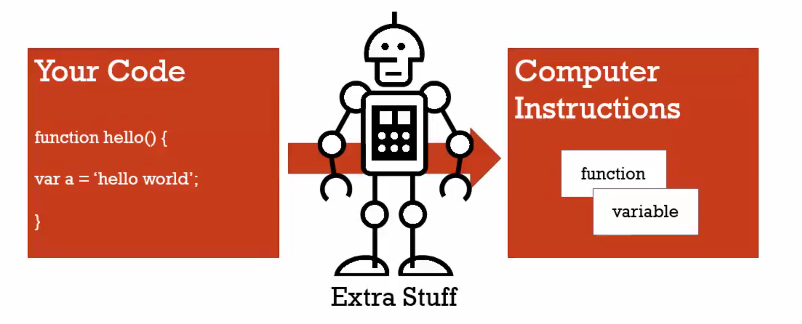

# 01 Conceptual aside syntax parsers execution context lexical environment

#### Syntax parser

A program that reads your code and determines what it does and if it's grammer is valid

Your code isn't magic. Someone else wrote a program to translate it for the computer

#### Lexical environment

Where somethings sits physically in the code you write

'Lexical' mean 'having to do with words or grammar'. A lexical environment exists in programming languages in which where you write something is important.

#### Execution context

A wrapper to help manage the code that is running

There are lots of lexical environments. Which one is currently running is managed via execution contexts. It can contain things beyoud what you've written in your code.