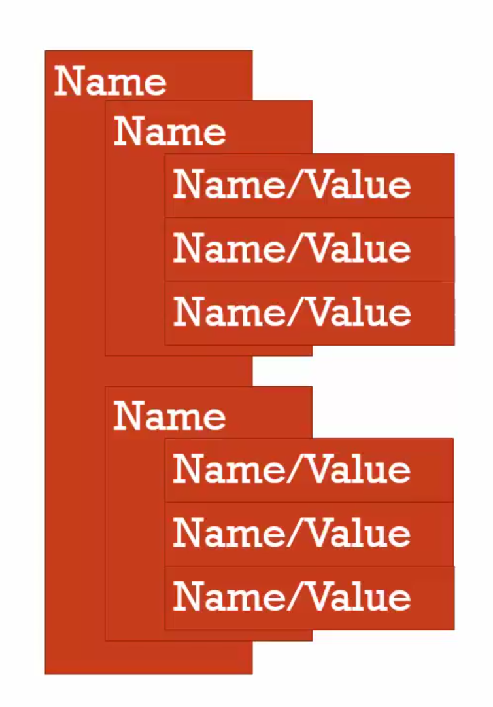

# 02 Conceptual aside namevalue pairs and objects

#### Name/ value pair

The name may be defined more than once, but only can have one value in any given ***context***.

```javascript
var address = '13/21 thailand'
```

#### Object

A collection of name value pairs



```javascript
var address = {
  street: 'main',
  number: 100,
  apartment: {
    floor: 3,
    number: 101
  }
}
```