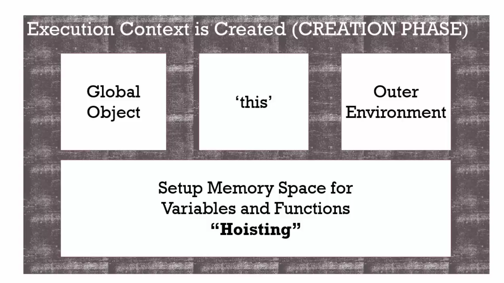

 # 04 The execution context createion and hoisting

#### Create phase

Set variable to undefind and function to memory before execution phase



```javascript
// example 1
var a = 2
console.log(a) // 2

// example 2
console.log(a)
var a = 2 // undefind

// example 3
console.log(a) // error not set in memory

// example 4
function log(a) {
  console.log(a)
}
log('test') // test

// example 5
log('test') // test
function log(a) {
  console.log(a)
} // because function set in create phase

```

#### Execution phase

Assign value and execution

