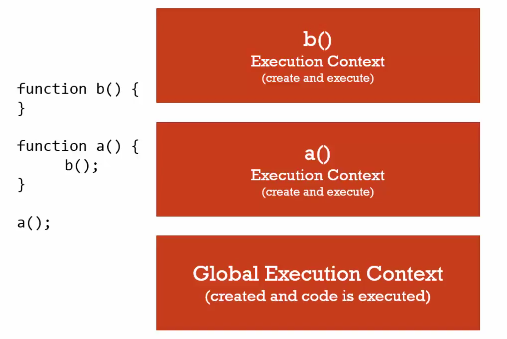

# 08 Function invocation and the execution stack

#### Invocation

Running a function

in javascript, by using parenthesis ()

#### Execution ***stack***




```javascript
function log() {
  console.log(a) // undefinded
  var a = 'nqmt'
}

log()
```