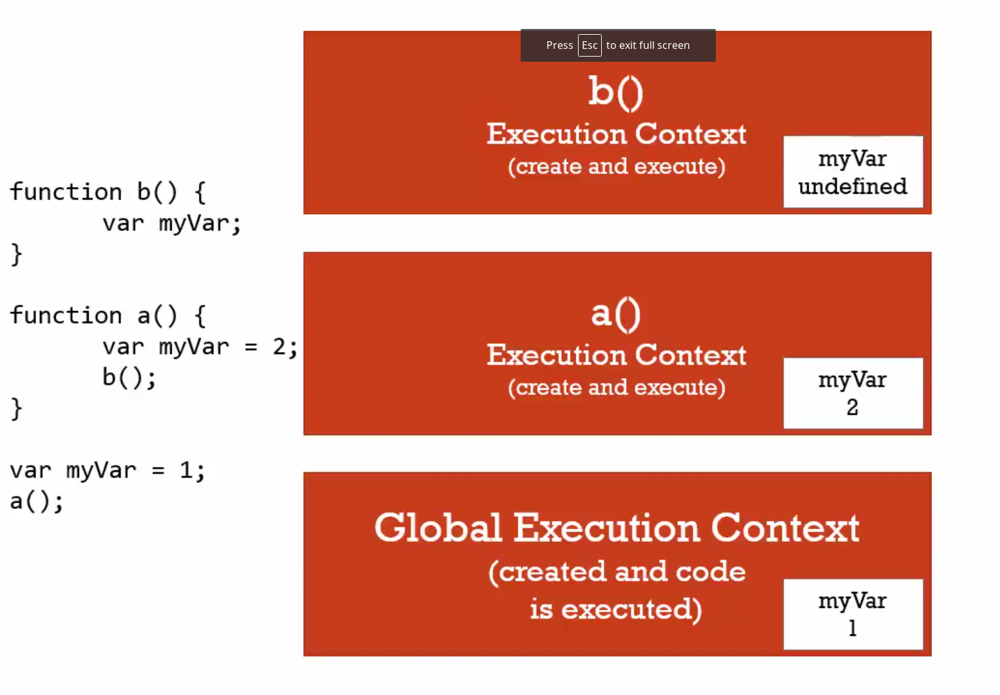

# 09 Function context and variable environment

#### Variable environment

Where the variable live

And how they relate to each other in memory



```javascript
function b() {
  var my;
  console.log(my)
}

function a() {
  var my = 2
  console.log(my)
  b()
}

var my = 1
console.log(my)
a()
```