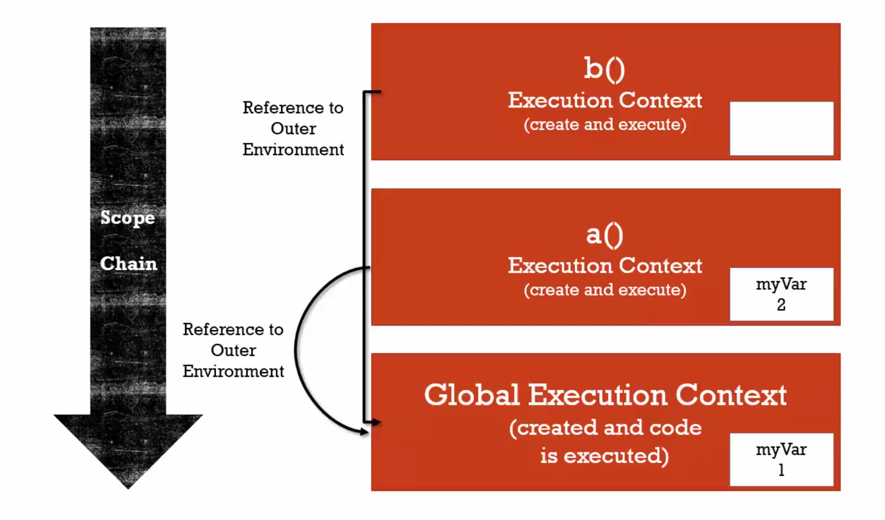
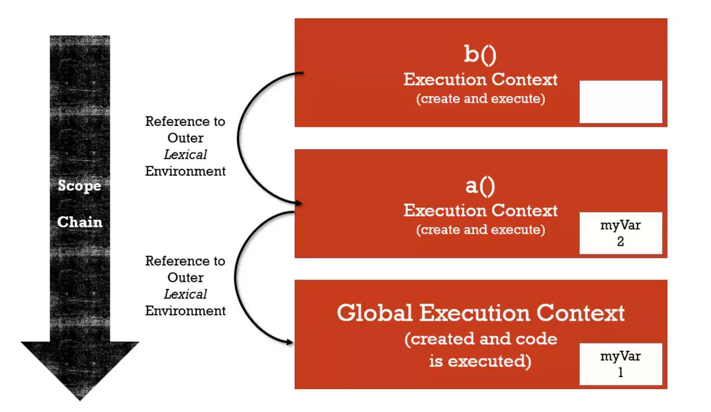

# 10 The Scope chain

Function It's scop chain reference point function create(lexical environment or ourter lexical or scope chain)

#### Example 1



```javascript
function b() {
  console.log(myVar) // 1
}

function a() {
  var myVar = 2
  b()
}

var myVar = 1
a()
```

#### Example 2



```javascript
function a() {
  function b() {
    console.log(myVar) // 2
  }
  var myVar = 2
  b()
}

var myVar = 1
a()
```