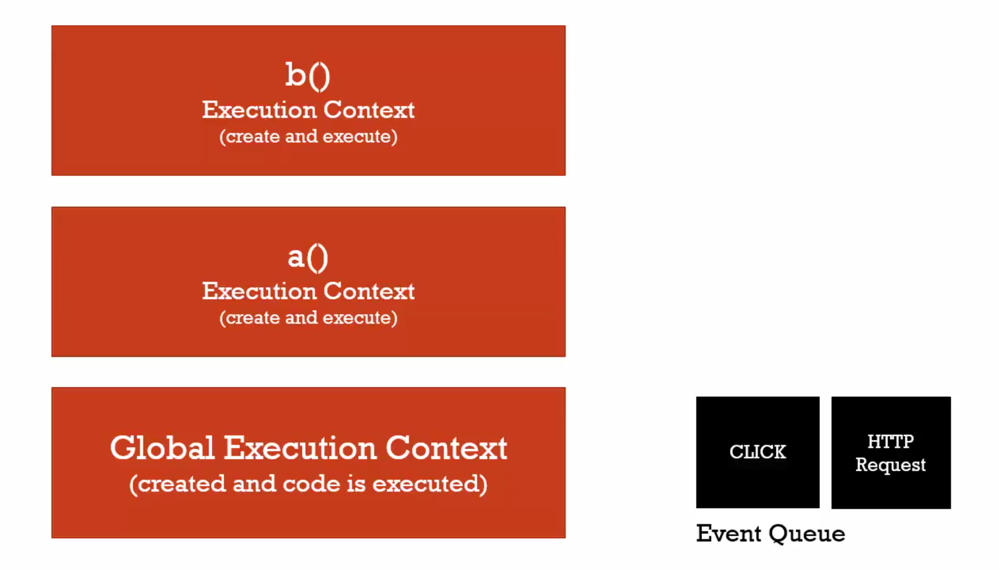
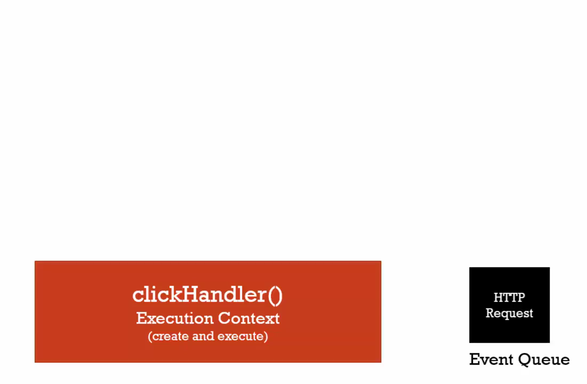

# 12 What about Asynchronous callbacks

#### Asynchronous

more than one at a time

in javascript wait execution stack empty then call event queue

#### Before



#### After



```javascript
function wait() {
  var ms = 3000 + new Date().getTime();
  while (new Date() < ms) {}
  console.log('finish wait')
}

function clickHandler() {
  console.log('click')
}

document.addEventListener('click', clickHandler)

wait()
console.log('finish end')

// finish wait
// finish end
// click
```