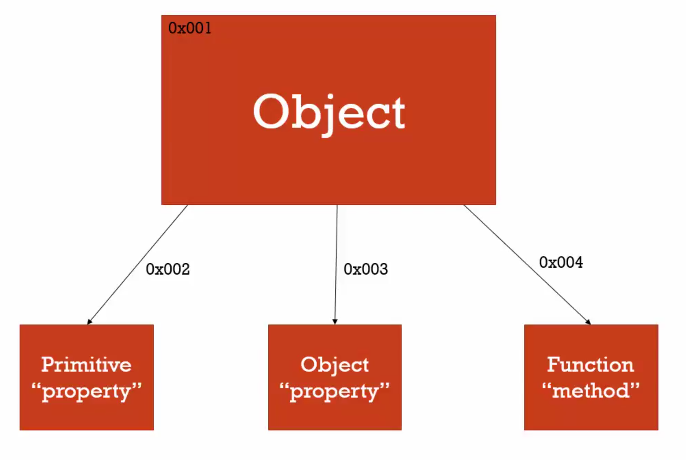

# 01 Object and the dot

#### Object can store

- Primitive
- object
- Function (method)



#### Create Object

```javascript
var person = new Object()
var person = {} // object literal
```

#### Initial Object

```javascript
// object literal
var obj = {
  firstname: 'nqmt',
  lastname: 'whyloop',
  address: {
    country: 'Thailand'
  }
}

var obj = new Object()
obj['firstname'] = 'nqmt'
obj['lastname'] = 'whyloop'
obj['address'] = new Object()
obj['address']['country'] = 'Thainland'
```

#### Access Object

```javascript
// dot
obj.firstname // nqmt
obj.address.country

var name = 'firstname'
obj['firstname']
obj[name]
obj['address']['country']
```

#### Set value object

```javascript
obj.firstname = 'nqmts'
obj.address.country = 'USA'

// reference by variable
var name = 'firstname'
obj['firstname'] = 'nqmts'
obj[name] = 'nqmts'
obj['address']['country'] = 'USA'
```