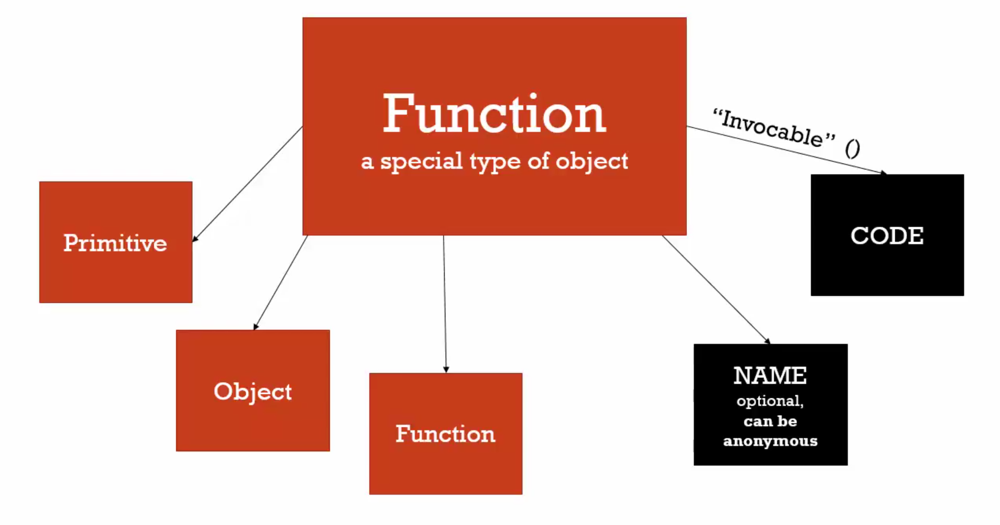

# 05 Function are Objects

#### First class function, function can do as primitive type

```javascript
function greet() {
  console.log('greet')
}

// !! function can add property, function is object in javascript
greet.firstname = 'nqmt'
greet.firstname // nqmt
greet.name // greet, name of function
```

#### Function in Javascript

