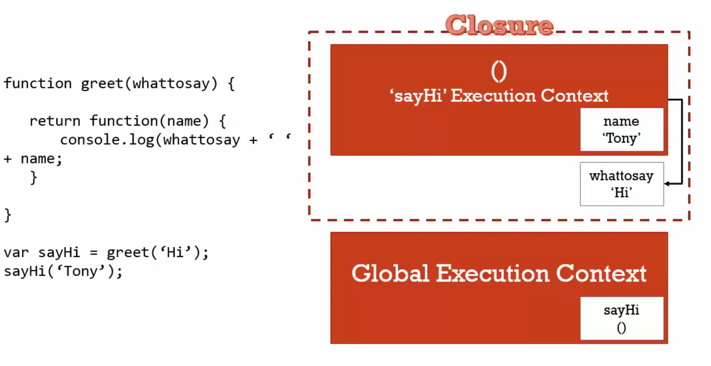

# 17 Understanding Closures

#### Closures is take parameter say at excution greet function

```javascript
function greet(say) {
  return function(name) {
    console.log(say + ' ' + name)
  }
}

var say = greet('Hi')
say('nqmt')

//short way
var say = greet('Hi')('nqmt')
```

> flow: global create -> greet() excution context -> pop greet() excution context return anonymouns function but take variable in greet() -> anonymouns excution context can access say

