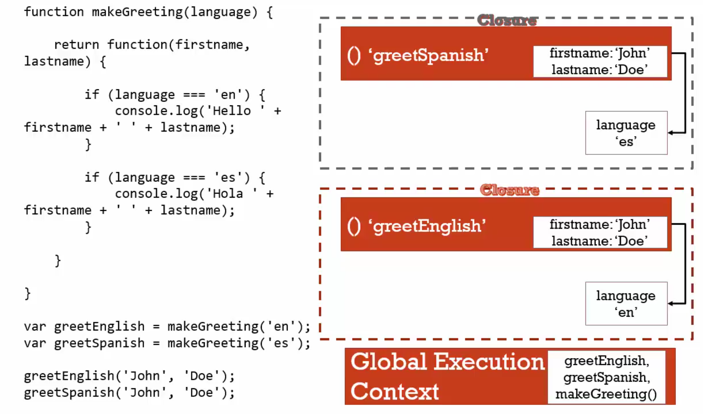

# 19 Framework Aside Function Factories

#### You make function reuse able and store old value (job) in before function, It's closure.

#### anytime you call function it use closure. it's own new excution context 

```javascript
function makePerson(job) {
  return function(firstname, lastname) {
    if (job === 'programmer') console.log('Programmer' + ': ' + firstname + ' ' + lastname)
    if (job === 'designer') console.log('Designer' + ': ' + firstname + ' ' + lastname)
  }
}

//Own excution context
var nqmt = makePerson('programmer')
nqmt('nqmt', 'whyloop') // Programmer : nqmt whyloop

// other excution context
makePerson('designer')('nqmt', 'whyloop') // Designer : nqmt whyloop
```

