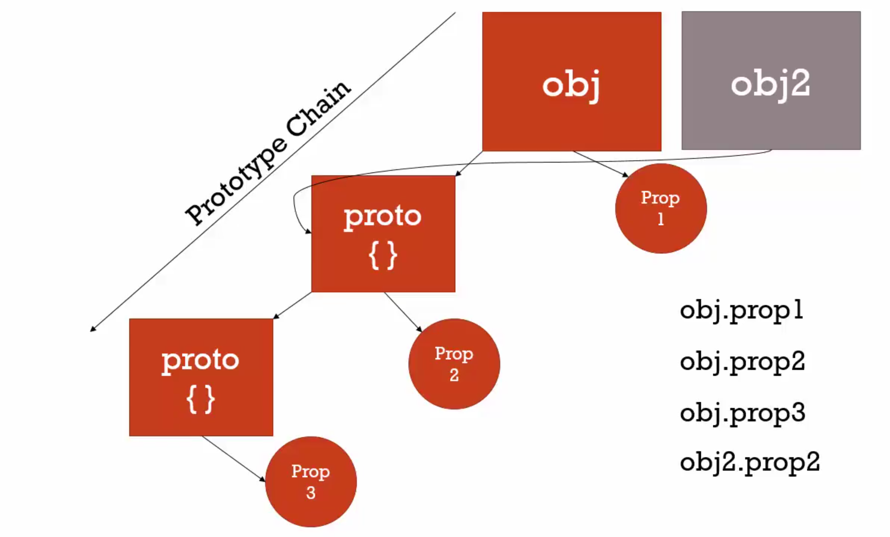

# 02 Understanding the protptype

```javascript
var nqmt = {
  firstname: 'nqmt',
  lastname: 'whyloop',
  getFullName: function() {
    console.log(this.firstname + ' ' + this.lastname)
  }
}

var john = {
  firstname: 'jonh',
}

// Don't do this __proto__, It's for explain
john.__proto__ = nqmt
console.log(john.getFullName())

```

