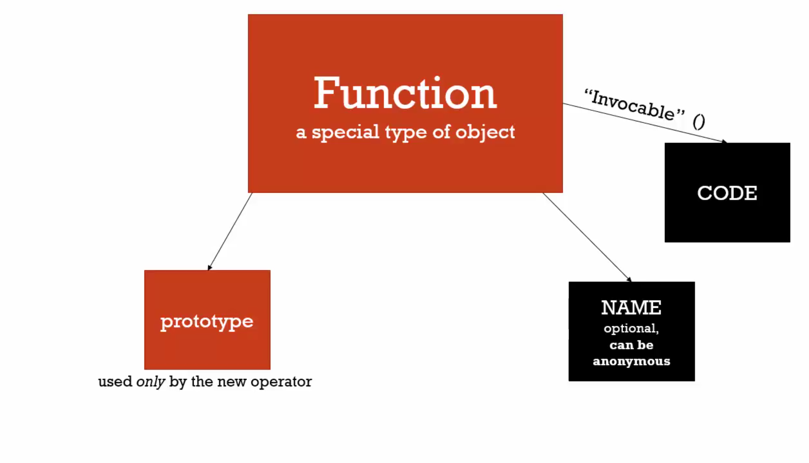

# 02 Function constructors and prototype



```javascript
function Person(firstname, lastname) {
  this.firstname = firstname
  this.lastname = lastname
  // this.getFullName = function () ...  this create amount of object be created
}

// prototype run in sequec not same function
Person.prototype.getFullName = function() {
  return this.firstname + ' ' + this.lastname
}

Person.prototype.getFormalFullName = function() {
  return this.lastname + ' ' + this.firstname
}
// Person Object
//  firstname
//  lastname
//   __proto__
//     getFullName()
//     getFormalFullName()

var nqmt = new Person('nqmt', 'whyloop')
var sun = new Person('sun', 'whyloop')
console.log(nqmt)
console.log(sun)
console.log(nqmt.getFormalFullName())
console.log(sun.getFormalFullName())
```